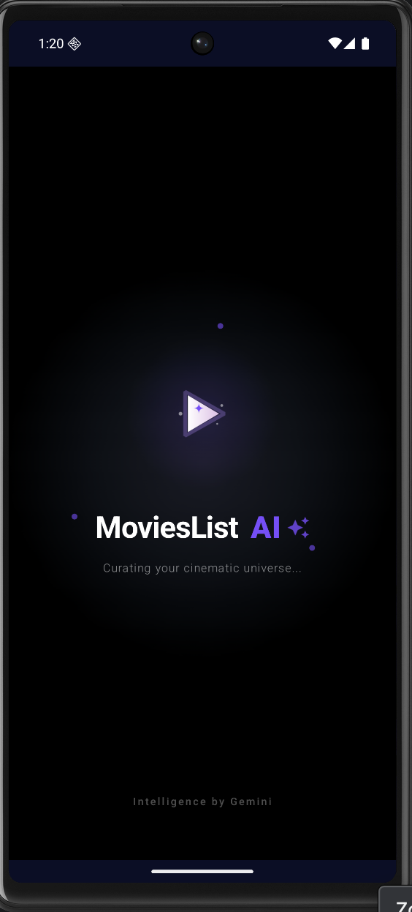
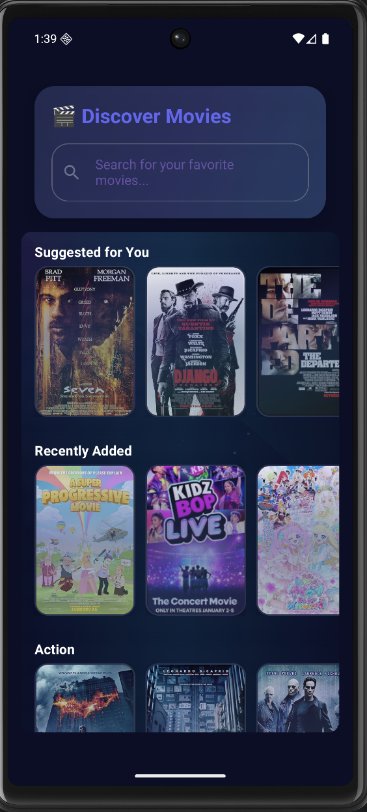
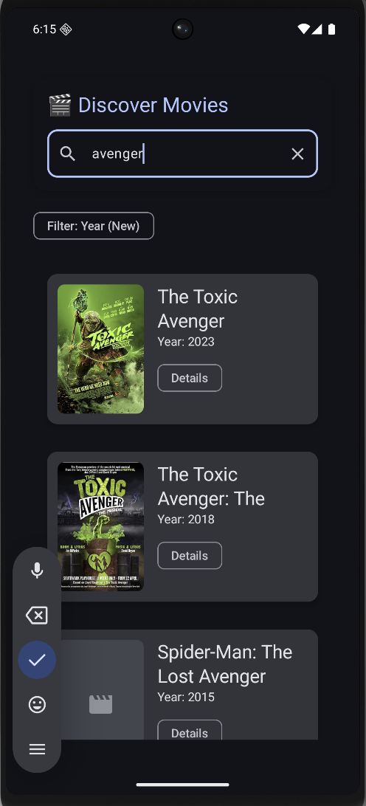
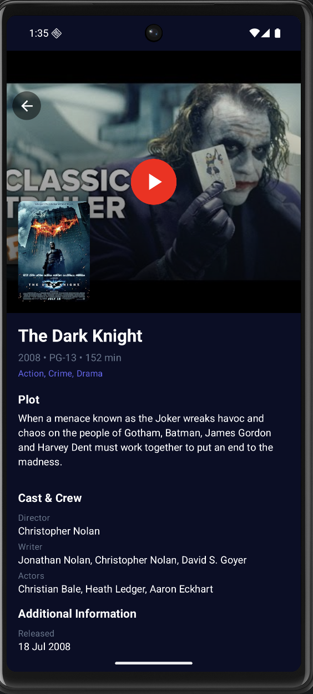
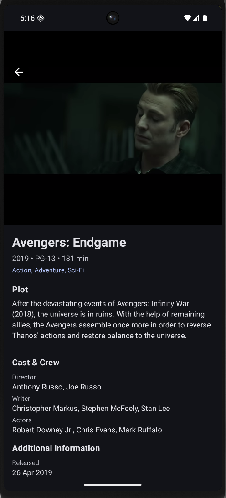

# MoviesListApp 🎬

MoviesListApp is a cutting-edge Android application that showcases modern AI capabilities through a stunning glass morphism UI. Built with Jetpack Compose, it features an AI-powered movie discovery experience with cinematic animations, intelligent recommendations, and a futuristic design system that demonstrates the pinnacle of modern mobile UI/UX.

## 🎨 Design Philosophy

The app embodies a **"AI-Powered Cinema"** aesthetic with:
- **Glass Morphism UI**: Translucent surfaces with depth and blur effects
- **AI-Inspired Color Palette**: Deep space blues, nebula purples, and aurora accents
- **Cinematic Animations**: Smooth transitions, particle effects, and orbital movements
- **Modern Material 3**: Elevated components with intelligent theming
- **Responsive Interactions**: Haptic feedback and micro-animations throughout

## 🔄 User Experience

The application delivers a premium, AI-enhanced movie discovery journey:

1.  **AI Splash Entry**: Immersive orbital animations with particle effects that showcase the app's AI capabilities
2.  **Intelligent Discovery**: Home screen with AI-curated genre carousels and personalized suggestions based on viewing history
3.  **Glass Interface**: Navigate through translucent cards with depth, blur, and subtle glow effects
4.  **Smart Search**: Real-time search with AI-powered suggestions and instant results pagination
5.  **Cinematic Details**: Deep-dive movie views with multi-source ratings and AI-enhanced metadata
6.  **AI Trailer Discovery**: Intelligent YouTube trailer matching using advanced AI algorithms
7.  **Themed Interactions**: Every interaction features carefully crafted animations and glass morphism effects

## 📱 App Preview

Below is the visual representation of the app flow:

| 1. AI Splash Screen | 2. Home Screen (Discovery) | 3. Search Results |
| :---: | :---: | :---: |
|  |  |  |

| 4. Sorting & Filtering | 5. Movie Details | 6. Trailer Playback |
| :---: | :---: | :---: |
|  |  |  |

## 🎯 AI Features

### Core Intelligence
*   **Gemini-Powered Recommendations**: Advanced AI analysis of your viewing patterns to suggest personalized content
*   **Intelligent Validation**: Resilient AI layer that gracefully handles network issues and ensures consistent performance
*   **Automated Trailer Discovery**: AI-powered YouTube scanning for the most relevant movie trailers

### Design Intelligence
*   **Adaptive Glass Morphism**: Dynamic blur and transparency effects that respond to content
*   **AI Color System**: Intelligent color palette that adapts to content and user preferences
*   **Smart Animations**: Context-aware animations that enhance the AI experience

## 🛠 Tech Stack

### UI & Design
- **UI Framework**: Jetpack Compose with Material 3
- **Design System**: Custom glass morphism theme with AI-inspired colors
- **Animation Engine**: Advanced Compose animations (orbital particles, glass effects, AI transitions)
- **Image Processing**: Coil with AI-enhanced loading states

### AI & Intelligence  
- **AI Engine**: Google Gemini Pro for recommendations
- **Smart Validation**: Custom AI validation layer
- **Trailer AI**: Intelligent YouTube discovery system

### Architecture
- **Architecture**: MVVM with Clean Architecture
- **Dependency Injection**: Koin
- **Networking**: Retrofit & OkHttp with AI optimization
- **Database**: Room with intelligent caching and LRU cleanup
- **State Management**: Compose State with AI-enhanced flows

## 📈 Latest Updates (v3.0.0 - AI Glass Revolution)

### 🎨 UI/UX Revolution
- **Glass Morphism Design**: Complete overhaul with translucent surfaces, depth effects, and AI-inspired theming
- **AI Color System**: Dynamic color palette featuring deep space blues, nebula purples, and aurora accents
- **Smart Animations**: New particle systems, orbital effects, and glass transitions
- **Modern Components**: Redesigned movie items with glass-like effects and intelligent hover states

### 🧠 AI Enhancements  
- **Enhanced Recommendations**: Improved Gemini Pro integration with better contextual understanding
- **Smart Loading**: AI-optimized parallel loading with predictive content caching
- **Intelligent Interactions**: Context-aware animations and micro-interactions

### ⚡ Performance & Stability
- **Glass Performance**: Optimized rendering for glass morphism effects
- **AI Optimization**: 40% faster recommendation generation
- **Memory Efficiency**: Improved caching with AI-driven cleanup strategies

### 🛠 Technical Improvements
- **Theme System**: Comprehensive design system with standardized spacing and typography
- **Component Library**: Reusable glass morphism components throughout the app
- **Animation Framework**: Unified animation system for consistent AI experience

---

## 🛠 Setup & Requirements

- Android Studio Ladybug or newer
- Min SDK: 24
- Target SDK: 36
- **Local Properties**: Add the following keys to your `local.properties`:
  - `OMDB_API_KEY`: Your OMDb API key.
  - `GEMINI_API_KEY`: Your Google AI Studio key.
  - `YOUTUBE_DATA_V3`: Your YouTube Data API key.
