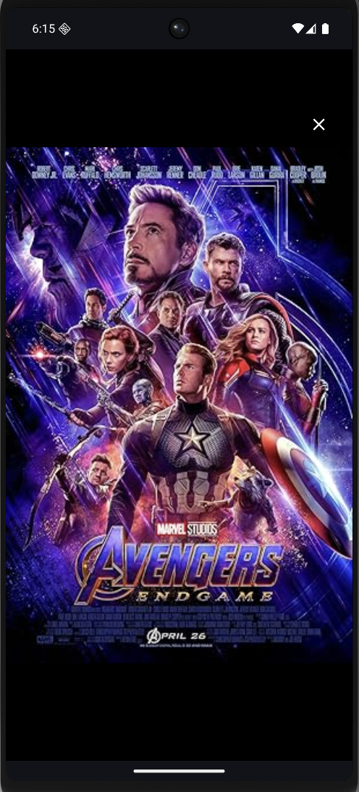

# MoviesListApp 🎬

MoviesListApp is a modern Android application built with Jetpack Compose that allows users to explore, search, and discover movies using the OMDb API. It features a rich UI with carousels, detailed movie information, and AI-powered trailer discovery.

## 🔄 User Flow

The application follows a seamless discovery-to-viewing flow:

1.  **Discovery (Home)**: Launch into a curated home screen featuring genre-based carousels (Action, Comedy, Sci-Fi) that are automatically populated with top-rated movies.
2.  **Interactive Posters**: Browse through high-quality movie posters with smooth transitions and interactive elements.
3.  **Real-time Search**: Use the global search bar to find any movie from the OMDb database with instant results.
4.  **Advanced Sorting**: Refine your search results using filters for Title or Year (Ascending/Descending).
5.  **Detailed Analysis**: Access a deep-dive view for any movie, including ratings from multiple sources, plot summaries, and cast info.
6.  **AI-Powered Playback**: The app uses an AI SDK to find the most relevant trailer on YouTube, allowing for instant in-app playback.

## 📱 App Preview

Below is the visual representation of the app flow:

| 1. Home Screen (Discovery) | 2. Poster Transitions | 3. Search Results |
| :---: | :---: | :---: |
|  |  |  |

| 4. Sorting & Filtering | 5. Movie Details | 6. Trailer Playback |
| :---: | :---: | :---: |
|  |  |  |

## 🚀 Features

*   **Dynamic Carousels**: Explore movies by popular categories (Action, Comedy, Sci-Fi) right on the home screen.
*   **Search**: Find any movie by title with real-time search and pagination support.
*   **Advanced Filtering**: Sort search results by Title or Year in ascending/descending order.
*   **Detailed View**: Get in-depth information about movies, including ratings, cast, plot, and runtime.
*   **AI Trailer Discovery**: Automatically find and play movie trailers using the integrated TrailerAI SDK and YouTube.
*   **Offline Support**: Local database caching using Room ensures you can view previously searched movies even without an internet connection.
*   **Connectivity Awareness**: Real-time monitoring of internet status with a sticky notification when offline.
*   **Modern Tech Stack**: Built with Jetpack Compose, Koin (DI), Retrofit, Room, and Coroutines/Flow.

## 🛠 Tech Stack

- **UI**: Jetpack Compose
- **Dependency Injection**: Koin
- **Networking**: Retrofit & OkHttp
- **Database**: Room
- **Image Loading**: Coil
- **Animation**: Compose Animations & Shimmer effects
- **Architecture**: MVVM with Clean Architecture principles

## 📖 How to Use

1.  **Home Screen**: Upon launching, the app displays carousels of top-rated movies for specific genres. Pull down to refresh the content.
2.  **Search**: Tap the search bar at the top to search for any movie. Results load dynamically as you scroll.
3.  **Filtering**: Use the filter chip under the search bar to sort results by title or year.
4.  **Movie Details**: Click on any movie card to see its full details.
5.  **Watch Trailer**: On the details screen, the app will automatically attempt to find the best trailer using AI. Tap the trailer section to watch.
6.  **Offline Mode**: Search results and details are saved locally. If you lose internet, a red banner will appear at the top, but you can still browse your cached content.

---

## 📈 Version History

### v2.1.0 (Current)
- **New Feature**: Added a "No Internet" sticky popup handling.
- **Improved**: Integrated `NetworkObserver` for real-time connectivity state management.
- **Fixed**: Resolved `toMovieDetailsEntity` receiver type mismatch compilation error.
- **Optimization**: Redesigned Carousel loading logic to use a lazy, genre-based fetching strategy to save bandwidth and improve startup time.

### v2.0.0
- **New Feature**: Integration of TrailerAI SDK for automated trailer discovery.
- **New Feature**: Home screen carousels for specific genres.
- **Improved**: Enhanced local database strategy with LRU-based cleanup to prevent excessive storage usage.
- **UI**: Added Shimmer effects for a smoother loading experience.

### v1.0.0
- Initial release with basic search and movie details functionality.
- Room database integration for basic caching.
- OMDb API integration.

---

## 🛠 Setup & Requirements

- Android Studio Ladybug or newer
- Min SDK: 24
- Target SDK: 35
- OMDb API Key (Add to `local.properties`)
- Gemini API Key (for TrailerAI discovery)
