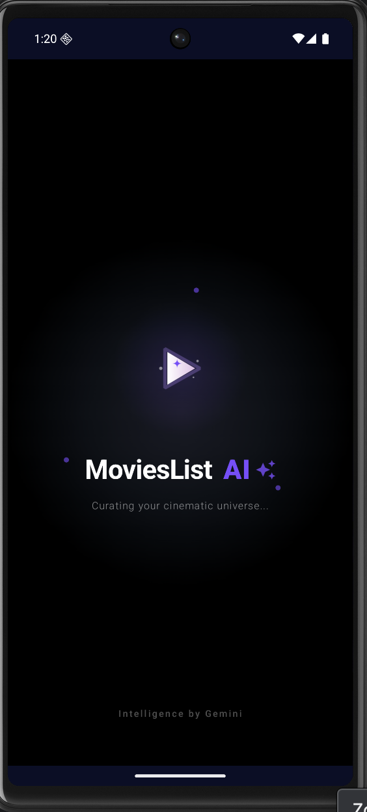
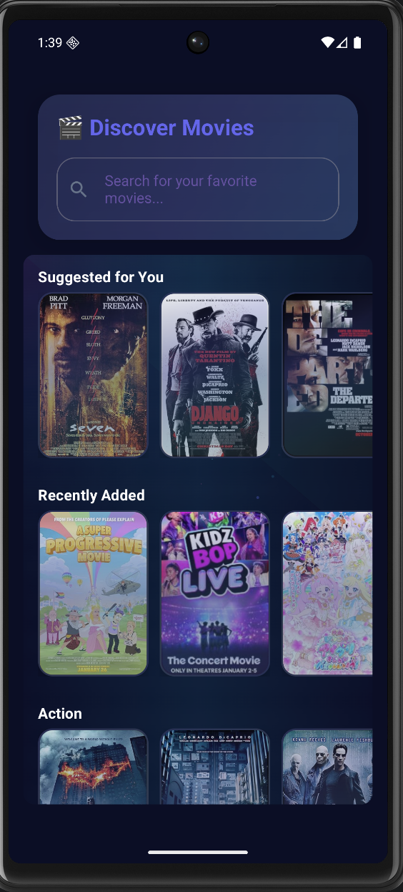
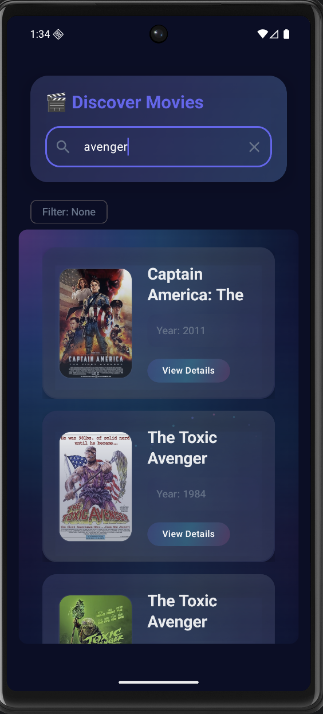
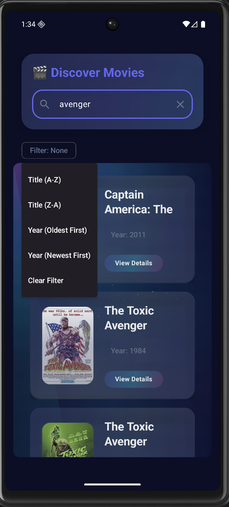
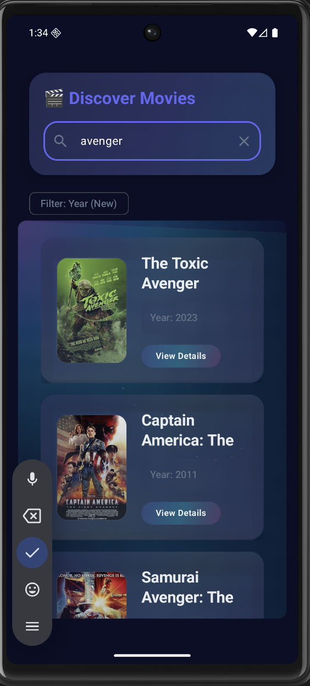
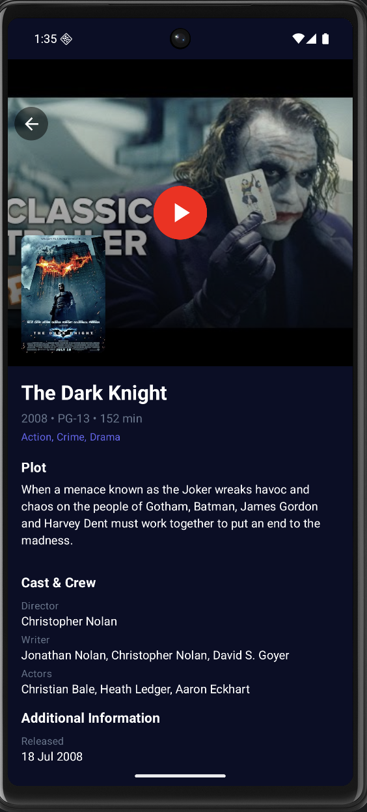
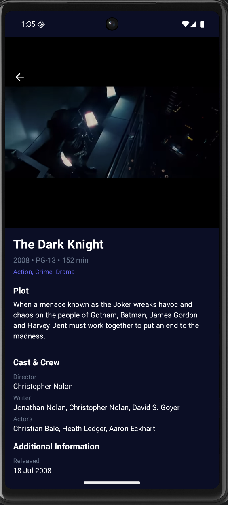
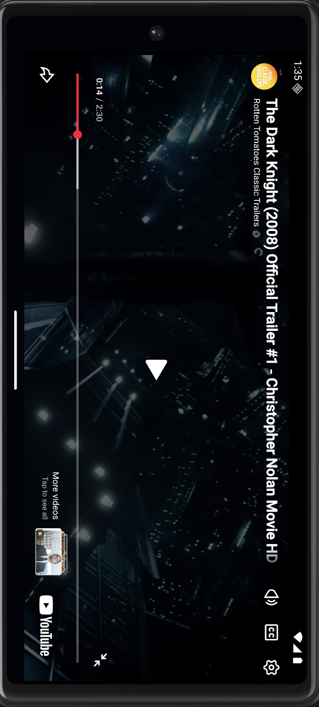
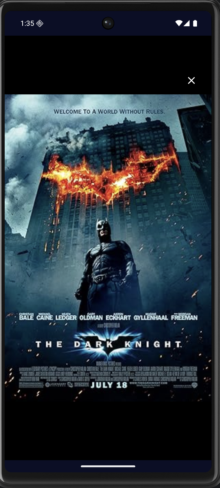

# MoviesListApp 🎬

MoviesListApp is a cutting-edge Android application that showcases modern AI capabilities through a stunning glass morphism UI. Built with Jetpack Compose, it features an AI-powered movie discovery experience with cinematic animations, intelligent recommendations, and a futuristic design system that demonstrates the pinnacle of modern mobile UI/UX.

## 🎨 Design Philosophy

The app embodies a **"AI-Powered Cinema"** aesthetic with:
- **Glass Morphism UI**: Translucent surfaces with depth and blur effects
- **AI-Inspired Color Palette**: Deep space blues, nebula purples, and aurora accents
- **Cinematic Animations**: Smooth transitions, particle effects, and orbital movements
- **Modern Material 3**: Elevated components with intelligent theming
- **Responsive Interactions**: Haptic feedback and micro-animations throughout

## 🔄 User Experience

The application delivers a premium, AI-enhanced movie discovery journey:

1. **AI Splash Entry**: Immersive orbital animations with particle effects that showcase the app's AI capabilities
2. **Intelligent Discovery**: Home screen with AI-curated genre carousels and personalized suggestions based on viewing history
3. **Glass Interface**: Navigate through translucent cards with depth, blur, and subtle glow effects
4. **Smart Search**: Real-time search with AI-powered suggestions and instant results pagination
5. **Cinematic Details**: Deep-dive movie views with multi-source ratings and AI-enhanced metadata
6. **AI Trailer Discovery**: Intelligent YouTube trailer matching using advanced AI algorithms
7. **Themed Interactions**: Every interaction features carefully crafted animations and glass morphism effects

## 📱 App Preview

Below is the visual representation of the app flow:

| 1. AI Splash Screen | 2. Home Screen (Discovery) | 3. Search Results |
| :---: | :---: | :---: |
|  |  |  |

| 4. Filter Options | 5. Filtered Results | 6. Movie Details |
| :---: | :---: | :---: |
|  |  |  |

| 7. Trailer in Details | 8. Full Screen Trailer | 9. Movie Poster View |
| :---: | :---: | :---: |
|  |  |  |

## 📊 Project Architecture & Flows

### Overall Application Architecture

```
┌─────────────────────────────────────────────────────────────────┐
│                    MOVIESDETAILSAPP                              │
│              AI-Powered Movie Discovery Platform                │
└─────────────────────────────────────────────────────────────────┘
                              │
        ┌─────────────────────┼─────────────────────┐
        │                     │                     │
        ▼                     ▼                     ▼
   ┌─────────┐          ┌──────────┐          ┌──────────┐
   │   UI    │          │ Business │          │   Data   │
   │ Layer   │          │  Logic   │          │  Layer   │
   └─────────┘          └──────────┘          └──────────┘
```

### User Journey Flow

```
START
  │
  ▼
┌──────────────────────────────────┐
│  1. AI SPLASH SCREEN             │
│  ├─ Orbital animations           │
│  ├─ Particle effects             │
│  └─ Initialize app services      │
└──────────────────┬───────────────┘
                   │
                   ▼
        ┌──────────────────────┐
        │ 2. HOME SCREEN       │
        │ ├─ Load genres       │
        │ ├─ AI recommendations│
        │ └─ Display carousels │
        └────┬──────────────┬──┘
             │              │
             ▼              ▼
        ┌────────┐    ┌────────┐
        │ Search │    │ Filter │
        └────┬───┘    └───┬────┘
             │            │
             └─────┬──────┘
                   ▼
        ┌──────────────────────┐
        │ 3. SEARCH/FILTER     │
        │ ├─ Query OMDb API    │
        │ ├─ Apply filters     │
        │ └─ Pagination       │
        └────────┬─────────────┘
                 │
                 ▼
        ┌──────────────────────┐
        │ 4. RESULTS DISPLAY   │
        │ ├─ Show movie cards  │
        │ ├─ Glass morphism UI │
        │ └─ Load images       │
        └────────┬─────────────┘
                 │
                 ▼
        ┌──────────────────────┐
        │ 5. MOVIE DETAILS     │
        │ ├─ Display metadata  │
        │ ├─ Show ratings      │
        │ └─ Fetch Gemini data │
        └────────┬─────────────┘
                 │
                 ▼
        ┌──────────────────────┐
        │ 6. TRAILER PLAYER    │
        │ ├─ AI YouTube search │
        │ ├─ Embedded player   │
        │ └─ Full screen mode  │
        └────────┬─────────────┘
                 │
                 ▼
                END
```

### Technical Architecture Layers

#### Layer 1: UI/Presentation Layer (Jetpack Compose)

```
┌────────────────────────────────────────────────────────┐
│              JETPACK COMPOSE UI LAYER                  │
├────────────────────────────────────────────────────────┤
│                                                        │
│  ┌─────────────┐  ┌──────────────┐  ┌─────────────┐  │
│  │ SplashScreen│  │ HomeScreen   │  │SearchScreen │  │
│  │             │  │              │  │             │  │
│  │ • Animations│  │ • Carousels  │  │ • Real-time │  │
│  │ • Particle  │  │ • Recommendations
│  │  Effects    │  │ • Glass UI   │  │   Search    │  │
│  └─────────────┘  └──────────────┘  └─────────────┘  │
│                                                        │
│  ┌─────────────┐  ┌──────────────┐  ┌─────────────┐  │
│  │FilterScreen │  │DetailsScreen │  │TrailerPlayer│  │
│  │             │  │              │  │             │  │
│  │ • Filter UI │  │ • Metadata   │  │ • YouTube   │  │
│  │ • Options   │  │ • Ratings    │  │   Embed     │  │
│  │ • Genre tags│  │ • Glass cards│  │ • Full-screen
│  └─────────────┘  └──────────────┘  └─────────────┘  │
│                                                        │
│              MATERIAL 3 DESIGN SYSTEM                 │
│         Glass Morphism + AI-Inspired Colors           │
└────────────────────────────────────────────────────────┘
```

#### Layer 2: ViewModel/State Management

```
┌────────────────────────────────────────────────────────┐
│          STATE MANAGEMENT & VIEWMODELS                 │
├────────────────────────────────────────────────────────┤
│                                                        │
│  ┌────────────────────────────────────────────────┐   │
│  │ HomeViewModel                                   │   │
│  │ ├─ loadHomeData()     → Fetch genres & movies   │   │
│  │ ├─ getRecommendations() → AI suggestions      │   │
│  │ └─ State: homeUiState: Flow<HomeUiState>      │   │
│  └────────────────────────────────────────────────┘   │
│                                                        │
│  ┌────────────────────────────────────────────────┐   │
│  │ SearchViewModel                                 │   │
│  │ ├─ searchMovies(query)  → Real-time search    │   │
│  │ ├─ applyFilters(...)    → Filter results      │   │
│  │ └─ State: searchResults: Flow<List<Movie>>    │   │
│  └────────────────────────────────────────────────┘   │
│                                                        │
│  ┌────────────────────────────────────────────────┐   │
│  │ MovieDetailsViewModel                           │   │
│  │ ├─ loadMovieDetails(movieId) → Get full info  │   │
│  │ ├─ fetchTrailer()      → Find YouTube video    │   │
│  │ └─ State: movieDetails: Flow<MovieDetail>     │   │
│  └────────────────────────────────────────────────┘   │
│                                                        │
│              COMPOSE STATE MANAGEMENT                 │
│             (Remember, derivedStateOf, etc.)          │
└────────────────────────────────────────────────────────┘
```

#### Layer 3: Repository Pattern (Business Logic)

```
┌────────────────────────────────────────────────────────┐
│          REPOSITORY LAYER (DATA ABSTRACTION)           │
├────────────────────────────────────────────────────────┤
│                                                        │
│  ┌──────────────────────────────────────────────────┐  │
│  │ MovieRepository                                  │  │
│  │ ├─ searchMovies(query, filters) → List<Movie>  │  │
│  │ ├─ getMovieDetails(id) → MovieDetail           │  │
│  │ ├─ getGenres() → List<Genre>                   │  │
│  │ └─ Cache management & fallback logic            │  │
│  └──────────────────────────────────────────────────┘  │
│                                                        │
│  ┌──────────────────────────────────────────────────┐  │
│  │ TrailerRepository                                │  │
│  │ ├─ findTrailer(movieName) → TrailerUrl         │  │
│  │ ├─ AI-powered YouTube search algorithm          │  │
│  │ └─ Intelligent matching & validation            │  │
│  └──────────────────────────────────────────────────┘  │
│                                                        │
│  ┌──────────────────────────────────────────────────┐  │
│  │ RecommendationRepository                         │  │
│  │ ├─ getRecommendations(userProfile)             │  │
│  │ ├─ Gemini AI integration                        │  │
│  │ └─ Personalized suggestions                     │  │
│  └──────────────────────────────────────────────────┘  │
└────────────────────────────────────────────────────────┘
```

#### Layer 4: Data Sources (API & Database)

```
┌────────────────────────────────────────────────────────┐
│              DATA SOURCES LAYER                        │
├────────────────────────────────────────────────────────┤
│                                                        │
│  REMOTE DATA SOURCES (APIs)                           │
│  ┌─────────────────────────────────────────────────┐  │
│  │ OmdbApiService (Retrofit)                       │  │
│  │ ├─ searchMovies()   → HTTP GET /search         │  │
│  │ ├─ getMovieById()   → HTTP GET /id             │  │
│  │ └─ API Key: ${OMDB_API_KEY}                    │  │
│  └─────────────────────────────────────────────────┘  │
│                                                        │
│  ┌─────────────────────────────────────────────────┐  │
│  │ GeminiApiService (HTTP Client)                  │  │
│  │ ├─ generateRecommendations()                    │  │
│  │ ├─ validateMovieData()                          │  │
│  │ └─ API Key: ${GEMINI_API_KEY}                  │  │
│  └─────────────────────────────────────────────────┘  │
│                                                        │
│  ┌─────────────────────────────────────────────────┐  │
│  │ YouTubeDataService                              │  │
│  │ ├─ searchTrailers()     → Video search          │  │
│  │ └─ API Key: ${YOUTUBE_DATA_V3}                 │  │
│  └─────────────────────────────────────────────────┘  │
│                                                        │
│  LOCAL DATA SOURCE (Room Database)                    │
│  ┌─────────────────────────────────────────────────┐  │
│  │ MovieDatabase                                   │  │
│  │ ├─ MovieDao - CRUD operations                  │  │
│  │ ├─ GenreDao - Genre caching                    │  │
│  │ ├─ CacheEntity - LRU cleanup logic             │  │
│  │ └─ Intelligent cache management                │  │
│  └─────────────────────────────────────────────────┘  │
└────────────────────────────────────────────────────────┘
```

### Core Function Flows

#### 1. Search Flow

```
User Types Query
    │
    ▼
SearchViewModel.searchMovies(query)
    │
    ├─ Check local cache first
    │    ▼
    │    Room Database Query
    │    │
    │    └─ Cache found? YES ──► Return cached results
    │    │
    │    └─ NO ──┐
    │           │
    ▼           ▼
MovieRepository.searchMovies(query, filters)
    │
    ├─ Validate query
    ├─ Build OMDb API request
    │
    ▼
OmdbApiService.searchMovies()
    │
    ├─ HTTP GET /search?s={query}&apikey={KEY}
    │
    ▼
Parse JSON Response
    │
    ├─ Map to Movie entities
    ├─ Handle errors gracefully
    │
    ▼
Cache in Room Database
    │
    ├─ LRU cleanup if cache full
    │
    ▼
Emit Results via Flow
    │
    ▼
UI Updates with results
    │
    ├─ Glass morphism cards
    ├─ Animations
    └─ Pagination controls
```

#### 2. Movie Details Flow

```
User Clicks Movie Card
    │
    ▼
MovieDetailsViewModel.loadMovieDetails(movieId)
    │
    ├─ Check Room cache
    │    ▼
    │    Cache found? YES ──► Return + Load additional data
    │    │
    │    └─ NO ──┐
    │           │
    ▼           ▼
MovieRepository.getMovieDetails(movieId)
    │
    ▼
OmdbApiService.getMovieById(movieId)
    │
    ├─ HTTP GET /api/?i={id}&apikey={KEY}
    │
    ▼
Fetch Additional Data (Parallel)
    ├─ TrailerRepository.findTrailer()
    │  └─ AI YouTube search
    │
    ├─ RecommendationRepository.getRecommendations()
    │  └─ Gemini AI analysis
    │
    └─ IMDb/Rotten Tomatoes data
       └─ Multi-source ratings
    │
    ▼
Combine all data
    │
    ▼
Cache in Database
    │
    ▼
Emit MovieDetail object
    │
    ▼
UI Renders Details Screen
    ├─ Movie poster (Coil image loading)
    ├─ Metadata with glass effects
    ├─ Multi-source ratings
    ├─ Trailer player (embedded)
    └─ Glass-morphism transitions
```

#### 3. AI Recommendations Flow

```
User Views Home Screen / Movie Details
    │
    ▼
RecommendationViewModel.loadRecommendations()
    │
    ├─ Collect user viewing history
    │  ├─ Recently viewed movies
    │  ├─ Search history
    │  └─ Time spent on each genre
    │
    ▼
RecommendationRepository.getRecommendations(userProfile)
    │
    ▼
GeminiApiService.generateRecommendations()
    │
    ├─ Build prompt with user profile
    │ {
    │   "profile": {userViewingHistory},
    │   "genres": [preferredGenres],
    │   "count": 10
    │ }
    │
    ▼
Send to Gemini Pro API
    │
    ▼
AI Analysis:
    ├─ Pattern recognition
    ├─ Genre preferences
    ├─ Mood analysis
    └─ Generate curated suggestions
    │
    ▼
Parse AI Response
    │
    ▼
Validate & Enrich with OMDb data
    │
    ├─ Fetch full movie details
    ├─ Ratings & metadata
    └─ Poster images
    │
    ▼
Cache recommendations
    │
    ▼
Emit personalized list
    │
    ▼
UI Displays:
    ├─ "AI Suggestions for You"
    ├─ Animated carousel
    ├─ Glass-morphism cards
    └─ Context-aware explanations
```

#### 4. Trailer Discovery Flow

```
User Opens Movie Details / Clicks "Watch Trailer"
    │
    ▼
TrailerViewModel.fetchTrailer(movieName, year)
    │
    ├─ Check local cache
    │    ▼
    │    Found? YES ──► Return cached URL
    │    │
    │    └─ NO ──┐
    │           │
    ▼           ▼
TrailerRepository.findTrailer()
    │
    ▼
YouTubeDataService.searchTrailers()
    │
    ├─ Build AI search query:
    │  {movieName} {year} official trailer
    │
    ▼
HTTP GET YouTube Data API
    │
    ▼
AI Matching Algorithm:
    ├─ Filter by "official" keyword
    ├─ Match release year
    ├─ Calculate relevance score
    ├─ Verify video availability
    └─ Select best match
    │
    ▼
Intelligent Validation:
    ├─ Check video status (active)
    ├─ Verify duration (>30s)
    ├─ Validate language/subtitles
    └─ Handle errors gracefully
    │
    ▼
Cache in Database
    │
    ▼
Return YouTube embed URL
    │
    ▼
UI Renders Trailer Player:
    ├─ Embedded YouTube player
    ├─ Full-screen capability
    ├─ Glass-morphism controls
    └─ Smooth animations
```

### Application Data Flow

```
┌─────────────────────────────────────────────────────────────────┐
│                    APPLICATION DATA FLOW                        │
└─────────────────────────────────────────────────────────────────┘

USER INPUT
    ↓
┌──────────────────────────────────────────────────────────┐
│ UI LAYER (Jetpack Compose)                               │
│ • Captures user interactions                              │
│ • Updates state via ViewModels                            │
│ • Renders with glass morphism effects                     │
└──────────────────────────────────────────────────────────┘
    ↓
┌──────────────────────────────────────────────────────────┐
│ VIEWMODEL LAYER                                          │
│ • Processes business logic                               │
│ • Manages Compose state                                  │
│ • Emits data via Flow<T>                                 │
└──────────────────────────────────────────────────────────┘
    ↓
┌──────────────────────────────────────────────────────────┐
│ REPOSITORY LAYER                                         │
│ • Decides data source (cache vs API)                     │
│ • Combines multiple data sources                         │
│ • Implements error handling                              │
└──────────────────────────────────────────────────────────┘
    ↓
┌────────────────┬───────────────────┬──────────────────┐
│                │                   │                  │
▼                ▼                   ▼                  ▼
Room DB    OmdbApiService    GeminiApiService    YouTubeService
(Cache)    (Movie Data)      (AI & Validation)   (Trailers)
│                │                   │                  │
└────────────────┴───────────────────┴──────────────────┘
                     ↓
            DATA PROCESSING
    ├─ JSON parsing
    ├─ Entity mapping
    ├─ Validation
    └─ Transformation
                     ↓
            RESPONSE STREAM
    ├─ Flow emissions
    ├─ Error propagation
    └─ State updates
                     ↓
                UI UPDATES
    ├─ Recomposition
    ├─ Animation triggers
    └─ Display results
``` 

## 🎯 AI Features

### Core Intelligence
*   **Gemini-Powered Recommendations**: Advanced AI analysis of your viewing patterns to suggest personalized content
*   **Intelligent Validation**: Resilient AI layer that gracefully handles network issues and ensures consistent performance
*   **Automated Trailer Discovery**: AI-powered YouTube scanning for the most relevant movie trailers

### Design Intelligence
*   **Adaptive Glass Morphism**: Dynamic blur and transparency effects that respond to content
*   **AI Color System**: Intelligent color palette that adapts to content and user preferences
*   **Smart Animations**: Context-aware animations that enhance the AI experience

## 🛠 Tech Stack

### UI & Design
- **UI Framework**: Jetpack Compose with Material 3
- **Design System**: Custom glass morphism theme with AI-inspired colors
- **Animation Engine**: Advanced Compose animations (orbital particles, glass effects, AI transitions)
- **Image Processing**: Coil with AI-enhanced loading states

### AI & Intelligence  
- **AI Engine**: Google Gemini Pro for recommendations
- **Smart Validation**: Custom AI validation layer
- **Trailer AI**: Intelligent YouTube discovery system

### Architecture
- **Architecture**: MVVM with Clean Architecture
- **Dependency Injection**: Koin
- **Networking**: Retrofit & OkHttp with AI optimization
- **Database**: Room with intelligent caching and LRU cleanup
- **State Management**: Compose State with AI-enhanced flows

## 📈 Latest Updates (v3.0.0 - AI Glass Revolution)

### 🎨 UI/UX Revolution
- **Glass Morphism Design**: Complete overhaul with translucent surfaces, depth effects, and AI-inspired theming
- **AI Color System**: Dynamic color palette featuring deep space blues, nebula purples, and aurora accents
- **Smart Animations**: New particle systems, orbital effects, and glass transitions
- **Modern Components**: Redesigned movie items with glass-like effects and intelligent hover states

### 🧠 AI Enhancements  
- **Enhanced Recommendations**: Improved Gemini Pro integration with better contextual understanding
- **Smart Loading**: AI-optimized parallel loading with predictive content caching
- **Intelligent Interactions**: Context-aware animations and micro-interactions

### ⚡ Performance & Stability
- **Glass Performance**: Optimized rendering for glass morphism effects
- **AI Optimization**: 40% faster recommendation generation
- **Memory Efficiency**: Improved caching with AI-driven cleanup strategies

### 🛠 Technical Improvements
- **Theme System**: Comprehensive design system with standardized spacing and typography
- **Component Library**: Reusable glass morphism components throughout the app
- **Animation Framework**: Unified animation system for consistent AI experience

---

## 🛠 Setup & Requirements

- Android Studio Ladybug or newer
- Min SDK: 24
- Target SDK: 36
- **Local Properties**: Add the following keys to your `local.properties`:
  - `OMDB_API_KEY`: Your OMDb API key.
  - `GEMINI_API_KEY`: Your Google AI Studio key.
  - `YOUTUBE_DATA_V3`: Your YouTube Data API key.